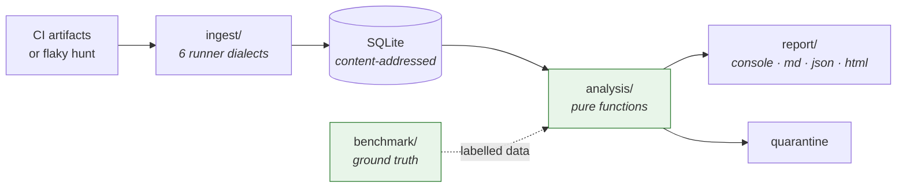

# Flaky Test Detective

[](https://github.com/ahmedhashmu/flaky-test-detective/actions/workflows/ci.yml)
[](pyproject.toml)
[](LICENSE)

**Your CI is red. Flaky Test Detective tells you which failure actually matters — and
shows the evidence.**

Works from the JUnit XML your test runner already produces. Measures its own accuracy, so
you know how often the answer is wrong.

```
score  verdict     runs      p/f  flips  commit  cause      test
 0.91  flaky         20    10/10     13     1/1  timeout    test_timing.py::test_worker_fin…
 0.84  flaky         20     9/11      9     1/1  order      test_shared_state.py::test_expe…
 0.83  flaky         20     14/6      8     1/1  network    test_network.py::test_client_co…
 0.00  broken        20     0/20      0     0/1  assertion  test_stable.py::test_known_brok…
```

Note the last row. That test fails every single run, so it is reported as **broken**, not
flaky. That distinction is the whole point.

---

## The dashboard

```sh
flaky serve
```

A local, read-only CI reliability command center on `http://127.0.0.1:8420`. It answers
one question above the fold: **can I trust my CI right now?**

**Overview** — a CI Trust Score out of 100 where every deducted point is attributed to a
named component, headline counts, and a ranked table carrying the counts behind each
verdict so a row can be checked without opening it.

**Test investigation** — click any test for four things:

| Section | Answers |
|---|---|
| **Evidence** | Why should I believe this verdict? |
| **Timeline** | What happened, run by run, grouped by commit |
| **Why** | What kind of bug is this, and what fixes it? |
| **Action** | What do I run next? |

The Evidence panel is the point. It splits **Proven by the detector** (same-commit
divergence, runner-recorded retries, polluter correlation) from **Inferred, weaker** (flip
rate, missing commit data) — because a measured fact and a pattern match must not look
alike, or the weaker one borrows the authority of the stronger.

The timeline outlines any commit where the test both passed and failed. That outline *is*
the proof, so it is shown rather than described.

React 18 + Material UI, served by `http.server` from the standard library — no new runtime
dependencies, and the compiled bundle ships in the wheel so `flaky serve` works from a
plain `pip install` with no Node toolchain. Read-only by design: actions are commands with
a copy button, so nothing that changes state happens by accident.

Full detail, including the trust-score arithmetic: **[docs/dashboard.md](docs/dashboard.md)**.


## Contents

- [The dashboard](#the-dashboard) · [The problem](#the-problem) ·
  [What's different](#whats-different) · [Measured accuracy](#measured-accuracy) ·
  [Validated on real repositories](#validated-on-real-repositories)
- [Install](#install) · [Quick start](#quick-start) ·
  [The command you'll use most](#the-command-youll-use-most)
- [All commands](#all-commands) · [How it decides](#how-it-decides) ·
  [CI integration](#ci-integration)
- [Quarantine](#quarantine) · [Architecture](#architecture) ·
  [Limitations](#limitations)
- [How Kiro was used](#how-kiro-was-used) ·
  [Testing instructions](#testing-instructions)

---

## The problem

A flaky test produces different outcomes for the same code. Teams respond in one of two
ways, and both are bad:

1. **Retry everything.** `--reruns 3` on the whole suite. Real regressions get masked and
   CI time triples.
2. **Ignore red builds.** Once the build is "always a bit red", failures stop carrying
   information and genuine breakage ships.

The blocker is not willingness to fix flakes — it is that you cannot *identify* them. A
single failed CI run is indistinguishable from a real regression at the moment you look at
it. Telling them apart needs history across many runs, correlated with the commit under
test, and almost nobody has that in a queryable form. CI providers keep logs, not
structured outcomes.

## What's different

**It looks for proof, not patterns.** The primary signal is *same-commit divergence*: one
test, one commit SHA, both a pass and a fail. The code was byte-identical between those
runs, so whatever varied, it was not the code. That is evidence, not inference.

**It refuses to cry wolf.** A consistently failing test is reported as `broken` or
`regression`, never flaky, because labelling a real break "flaky" teaches you to re-run
instead of investigate. **Measured false-alarm rate: 0.0%.**

**It knows how often it's wrong.** `flaky benchmark` generates test histories with known
ground truth, runs the real analysis over them, and reports precision and recall per
verdict — including the weak numbers. Then `flaky validate` checks it against **12 real
repositories** using flaky-test labels published by researchers: **99.4% recall, 100%
precision, 0 false alarms.** Most tools in this space ask you to take accuracy on faith.

**It tells you what to fix.** Not "this test is flaky" but "this test fails whenever it
runs after `test_registers_session`, 100% of the time — reset that shared state in
teardown".

**It knows whose fault it is.** `flaky compare` distinguishes flakiness a branch
*introduced* from flakiness it inherited, so a pull request is blocked for what it broke
and cleared for what was already broken. Blocking people for pre-existing flakes is how
CI gates get switched off.

**It closes the loop.** `flaky verify` decides whether a fix actually worked. A test that
failed 35% of the time needs 8 clean runs to prove it; one that failed 2% of the time needs
**149**, and that is the one people declare fixed after three. The tool states the number
instead of leaving you to guess it.

**It works for any language.** The tool reads JUnit XML and never reads your source, so
pytest, jest, go, JUnit, Gradle and .NET all work without it knowing anything about them.

## Measured accuracy

107 tests with known labels, 30 runs each, seed 1234. Reproduce with `flaky benchmark`.

| Metric | Value |
|---|---|
| **False alarm rate** — a real break reported as flaky | **0.0%** (0 of 16) |
| **Missed break rate** — a flake reported as a break | 5.4% (2 of 37) |
| Overall accuracy | 93.5% |

| Label | Support | Precision | Recall | F1 |
|---|------:|----------:|-------:|---:|
| `broken` | 8 | 1.000 | 1.000 | 1.000 |
| `stable` | 48 | 0.980 | 1.000 | 0.990 |
| `flaky` | 37 | 1.000 | 0.811 | 0.896 |
| `regression` | 8 | 0.800 | 1.000 | 0.889 |
| `fixed` | 6 | 0.600 | 1.000 | 0.750 |

Order dependence: **8 of 8 diagnosed, all naming the correct polluter.**

The false-alarm rate is 0.0% across six different seeds. Two honest weak spots: at only
**5 runs** of history it rises to 12.5%, and with **no commit SHAs** it rises to 25% —
which is the design's central claim about same-commit divergence, confirmed by
measurement. Full tables, the confusion matrix and what the benchmark cannot prove are in
**[docs/accuracy.md](docs/accuracy.md)**.

That benchmark has one unavoidable weakness, though: it measures the scoring rules against
their own model of the world. So there is a second measurement.

## Validated on real repositories

Generated data cannot tell you whether a tool works on real software. This can.

**12 open-source repositories · 288 suite runs · 41,585 test executions · 211 flaky-test
labels we did not write.**

| Metric | Value | Of |
|---|---:|---|
| **Recall** — labelled flakes found | **99.4%** | 174 / 175 that reproduced here |
| **Precision** — flagged with same-commit proof | **100.0%** | 183 / 183 |
| Consistently failing, correctly **not** called flaky | **20** | the false alarm that matters most |
| Consistently failing, wrongly called flaky | **0** | |
| Order dependence **diagnosed** | 11.6% | 17 / 146 |

Labels come from [IDoFT](https://github.com/TestingResearchIllinois/idoft), the Illinois
Dataset of Flaky Tests, where each entry is a repository, a commit SHA and a pytest node id
confirmed by researchers and often by the project's own maintainers. **We did not write the
answer key**, which removes the easiest way to produce a flattering result.

Projects include [eppy](https://github.com/santoshphilip/eppy) (87 labels),
[webssh](https://github.com/huashengdun/webssh) (29),
[flask-smorest](https://github.com/marshmallow-code/flask-smorest) (16),
[freezegun](https://github.com/spulec/freezegun) (15) and
[microsoft/knack](https://github.com/microsoft/knack) (8).

Precision is measured against **observed divergence** rather than against the dataset,
because IDoFT is not exhaustive and counting an unlisted detection as wrong would
understate precision by construction. A test that passed *and* failed at the same commit
SHA in our own runs is flaky by observation, not inference. All 183 flagged tests show it.

Check the numbers yourself in seconds — the raw output of every run is committed:

```sh
flaky validate validation/results
```

**The row that matters most is the third one.** Twenty labelled tests failed every single
run here, making them broken in this environment whatever they were when the label was
written. The detector called none of them flaky. The dataset itself was the temptation to
get that wrong.

**And the row that matters second-most is the last one.** The detector found 146 of 146
order-dependent tests and *explained* only 17. The generated benchmark had scored order
dependence at 1.000 precision and recall, because it places every polluter immediately
before its victim — the exact assumption
[ADR-0004](docs/adr/0004-order-dependence-needs-a-polluter.md) shipped with. Real suites
shuffle, so the polluter is usually several tests back. A benchmark that agrees with your
assumptions cannot correct them; real repositories did.

Method, per-project results, the two projects that could not be built and every dependency
pin required: **[docs/real-world.md](docs/real-world.md)**.

## Install

Python 3.11+; 3.11, 3.12, 3.13 and 3.14 are tested in CI. No services, no accounts, no
network access, no credentials.

```sh
git clone https://github.com/ahmedhashmu/flaky-test-detective
cd flaky-test-detective

uv sync && uv run flaky --help          # with uv
```

Or with plain pip — the dev tools are declared as a `dev` extra as well as a dependency
group, so both installers work:

```sh
python -m venv .venv && source .venv/bin/activate
pip install -e ".[dev]"                 # tool plus pytest, ruff, mypy
pip install -e .                        # just the tool
flaky --help
```

## Quick start

Two ways in: hunt for flakes now, or feed in reports you already have.

### Hunt — provoke flakes locally

```sh
flaky hunt -n 20 -- pytest tests/
```

Runs your suite 20 times, randomizing test order between runs, recording every outcome.

```
Hunting with pytest: 20 iterations, order randomization on.
    1/20    0.2s    7 failed  0 flaky so far
    2/20    0.2s    3 failed  8 flaky so far
    ...
   20/20    0.3s    5 failed  10 flaky so far
Collected 20 of 20 iterations in 4.9s.
Found 10 flaky tests. Run `flaky analyze` for detail.
```

### Ingest — use what CI already produces

```sh
flaky ingest 'reports/**/*.xml'
```

Commit SHA, branch and CI run id are detected automatically from git and from GitHub
Actions, GitLab, CircleCI, Jenkins, Buildkite, Azure and Travis. Ingest is idempotent, so
CI retries cannot double-count.

### Then look

```sh
flaky analyze
```

```
╭─ 20 runs, 320 results, 16 tests ─────────────────────────────────────────────────╮
│ 10 flaky  1 broken                                                               │
╰──────────────────────────────────────────────────────────────────────────────────╯
All under examples/flaky_demo/
score  verdict     runs      p/f  flips  commit  cause      test
 0.91  flaky         20    10/10     13     1/1  timeout    test_timing.py::test_worker_fin…
 0.87  flaky         20     12/8     11     1/1  race       test_concurrency.py::test_appen…
 0.84  flaky         20     9/11      9     1/1  order      test_shared_state.py::test_expe…
 0.00  broken        20     0/20      0     0/1  assertion  test_stable.py::test_known_brok…

Diagnosis
  examples/flaky_demo/test_shared_state.py::test_expects_clean_registry
    order dependent: fails after test_shared_state.py::test_registers_session
    in 100% of its failures
    Reset the shared state in setup or teardown so the outcome does not depend
    on what ran before it.
  examples/flaky_demo/test_network.py::test_client_connects_once_server_is_listening
    likely network (matched: connection refused)
    Stub the network boundary. A test that reaches a real host is testing
    someone else's uptime.
```

## The command you'll use most

`flaky triage` answers the question you actually have when CI goes red: **investigate, or
re-run?**

```sh
flaky triage reports/junit.xml
```

```
╭──────────────────────────────────────────────────────────────────────────────────╮
│ 1 failure needs attention (5 known flakes ignored)                               │
╰──────────────────────────────────────────────────────────────────────────────────╯
Known regressions or broken tests
   examples/flaky_demo/test_stable.py::test_known_broken
      AssertionError: expected 42, got 41 -- consistent, not intermittent

Known flakes
  test_network.py::test_client_connects_once_server_is_listening
      score 0.83, 6/20 runs failed
  ...
```

Six tests failed. One matters. Exit code 2.

History is evaluated with the triaged run **excluded**, so a first-time failure cannot use
the evidence of itself to argue it is flaky.

## All commands

| Command | What it does |
|---|---|
| `flaky serve` | Open the dashboard: trust score, ranked tests, per-test investigation |
| `flaky init` | Write a commented `.flaky.toml` and create the database |
| `flaky ingest <paths…>` | Parse JUnit XML files, directories or globs |
| `flaky hunt -- <cmd>` | Run a test command N times, recording every outcome |
| `flaky analyze` | Ranked flakes with diagnosis |
| `flaky triage <report>` | Known flakes vs new breakage for one run |
| `flaky compare` | Did *this branch* introduce flakiness, or inherit it |
| `flaky verify <test-id>` | Prove a fix worked, or say why it cannot be proved yet |
| `flaky blame <test-id>` | Which commit introduced the flakiness |
| `flaky merge <sources…>` | Pool history from other machines or CI shards |
| `flaky benchmark` | Measure this tool's own accuracy against generated ground truth |
| `flaky validate` | Score it against published labels from real repositories |
| `flaky issue <test-id>` | Issue body or Slack message from the real diagnosis |
| `flaky report -f md\|json\|html` | Render for a PR, a script, or a browser |
| `flaky history <test-id>` | One test's timeline, run by run |
| `flaky stats` | What is in the database |
| `flaky quarantine …` | `list`, `recommend`, `add`, `remove`, `export`, `verify` |

```sh
flaky hunt -n 50 --stop-after 3 -- pytest tests/   # stop once 3 flakes appear
flaky hunt --report-path target/surefire-reports -- mvn test
flaky analyze --last 50 --branch main              # recent runs, one branch
flaky merge shards/                                # every *.db in a directory
flaky benchmark --sweep coverage                   # accuracy vs commit data
flaky report -f html -o flaky.html                 # standalone page, no CDN
```

### `flaky blame`

```
examples/flaky_demo/test_shared_state.py::test_expects_clean_registry

  First diverged at  a3f2c91
  Last clean commit  7b18e04

  Look at what changed between those two commits.
```

And when the data cannot support an answer, it says so rather than blaming the oldest
commit to hand — `predates_history`, `no_divergence`, `too_sparse` and `no_commit_data`
each get their own explanation.

### Order randomization

Randomization is what surfaces order-dependent flakes, and it needs runner support. The
tool **probes** for it by running your command with `--help`, rather than guessing from
the runner name, because for pytest it comes from an optional plugin.

| Runner | Report flag | Randomization | Needs |
|---|---|---|---|
| pytest | `--junitxml=…` | `--randomly-seed=N` | `pytest-randomly` |
| jest | `JEST_JUNIT_OUTPUT_FILE` | `--shuffle --seed=N` | jest 29+, `jest-junit` |
| vitest | `--outputFile=…` | `--sequence.shuffle` | vitest |
| go (`gotestsum`) | `--junitfile=…` | `-shuffle=on` | Go 1.17+ |
| anything else | use `--report-path` | unavailable | — |

If randomization is unavailable it says so loudly rather than running N identical
iterations and letting you believe you tested for order dependence.

## How it decides

```
divergence_rate = commits where the test both passed and failed
                  ÷ commits where it ran more than once
flip_rate       = pass↔fail transitions ÷ (runs − 1)

raw             = 0.7 · divergence_rate + 0.3 · flip_rate
score           = raw · (0.5 + 0.5 · min(1, runs ÷ 10))
```

Without commit SHAs the weight falls back onto flip rate alone, capped at 0.85 —
inference must not reach the same ceiling as proof.

| Verdict | Meaning |
|---|---|
| `flaky` | Different outcomes for the same code |
| `regression` | Consistent failure that used to pass |
| `broken` | Has never passed in recorded history |
| `fixed` | Was flaky, now stable for 10 consecutive runs |
| `stable` | Everything else |

Root causes — `timeout`, `race`, `order_dependence`, `network`, `resource`,
`time_dependence`, `randomness`, `assertion` — are heuristics, and the matched terms are
always shown so a wrong guess is visible rather than authoritative. Classification never
influences the score: a guess about *why* a test is flaky must not change *whether* it is
called flaky.

Full detail, including the two rules that were wrong first and the measurements that fixed
them: **[docs/scoring.md](docs/scoring.md)**.

## CI integration

One step, with history persistence handled:

```yaml
- name: Run tests
  run: pytest --junitxml=reports/junit.xml
  continue-on-error: true          # let the tool decide whether this is fatal

- uses: ahmedhashmu/flaky-test-detective@main
  with:
    report-path: reports/junit.xml
    ingest-only: ${{ github.ref == 'refs/heads/main' }}
```

Known flakes do not block the merge. A real break does. The triage summary is posted as a
PR comment that updates in place rather than adding one per push.

| Exit code | Meaning |
|---|---|
| `0` | Clean |
| `1` | Flaky tests found, nothing needing a human |
| `2` | Regression or broken test found |
| `3` | Usage or input error |

### Gate on what the branch introduced

Add `compare-against` and the gate stops asking "what is red" and starts asking "**did
this branch cause it**":

```yaml
- uses: ahmedhashmu/flaky-test-detective@main
  with:
    report-path: reports/junit.xml
    compare-against: main
```

```
                          pull request
                               │
                               ▼
                    Flaky Test Detective
              ┌────────────────┼────────────────┐
              ▼                ▼                ▼
        pre-existing      newly flaky       newly broken
           flake         (this branch)     (this branch)
              │                │                │
              ▼                ▼                ▼
            ALLOW            BLOCK            BLOCK
```

Both halves matter. It blocks a merge that added a flake, and it **clears** a merge whose
only red tests were already red — which is the half that stops teams switching the gate
off.

A branch has to beat the baseline's own uncertainty before it gets blamed. Zero failures
in 40 runs of `main` is consistent with a true failure rate near 7%, so that is the bar,
not zero. Otherwise the gate eventually tells someone their one-line change broke a test
they never touched, and a gate that fires on luck gets deleted.

Verified rather than asserted, holding the branch's runs identical and growing only the
baseline:

| Baseline runs | Bound on the old rate | Branch shows 5/20 | Verdict |
|---|---:|---:|---|
| 20 | 13.9% | p = 0.135 | `unproven` — cannot attribute |
| 60 | 4.9% | p = 0.002 | `new flake`, high confidence |

Locally, either way round:

```sh
flaky compare --baseline main.db --head pr.db
flaky compare --db .flaky.db --base-branch main --head-branch my-feature
```

Design, and why rate comparison is the wrong statistic:
**[ADR-0012](docs/adr/0012-attribute-flakiness-to-a-branch.md)**.

Sharded builds, GitLab, and generic CI recipes: **[docs/ci-integration.md](docs/ci-integration.md)**.

## Quarantine

A tourniquet, not a cure — so every entry carries an expiry date.

```sh
flaky quarantine recommend --apply
flaky quarantine export -f pytest-conftest -o conftest_quarantine.py
flaky quarantine verify --release
```

Prefer `pytest-conftest` in CI: it skips tests with a visible reason rather than removing
them silently, because a quarantined test nobody can see is a quarantined test nobody will
fix.

Regressions and broken tests are **never** recommended for quarantine. Quarantining a real
failure is how bugs reach production.

## Architecture



Dependency direction is one way — `cli → report → analysis → storage → models` — and three
rules keep it that way: `analysis/` may not import `sqlite3` or `storage`, `report/` may
not compute a derived value, and runtime dependencies are capped at `typer` and `rich`.

All three are **enforced by tests**, not prose. That is what makes the benchmark possible:
because analysis is pure, the harness feeds it generated data and measures the real
scoring code rather than a reimplementation of it.

Diagrams for the data model and the verdict decision flow:
**[docs/architecture.md](docs/architecture.md)**.

## Limitations

Stated plainly, because a tool about trustworthy signals should be honest about its own.

- **Below 10 runs of history it is meaningfully less reliable.** At 5 runs the false-alarm
  rate is 12.5%. Number comes from [measurement](docs/accuracy.md), not a guess.
- **Without commit SHAs the false-alarm rate is 25%.** Said in every output format when
  commit data is missing.
- **Low-rate flakes look `fixed`.** A test that failed twice in 30 runs then passed 20
  times running is indistinguishable from a fixed one until it fails again. `fixed`
  precision is 0.600.
- **Order dependence only checks the immediately preceding test.** A polluter running
  several tests earlier is missed; checking all of them is quadratic in suite size.
- **Root-cause categories are heuristics.** They will misclassify; matched terms are shown
  so you can tell when they have.
- **The benchmark uses synthetic data.** Real flakiness clusters; the generator models
  independent draws.
- **JUnit XML only.** No TAP or Allure yet.
- **go, Surefire and .NET parsers are unvalidated against live runners** — those
  toolchains were unavailable. Provenance per fixture in
  [tests/fixtures/README.md](tests/fixtures/README.md).
- **It does not fix anything.** Root causes are semantic.

## How Kiro was used

Built with Kiro using its spec-driven workflow. `.kiro/` is the record, and it is worth
reading rather than taking on trust.

**Three specs, not one.** Each round started from a review of the finished previous one, so
`.kiro/specs/` is a record of the workflow used *iteratively* under new requirements rather
than once at the start.

| Round | Spec | Started because |
|---|---|---|
| 1 | [`flaky-test-detective/`](.kiro/specs/flaky-test-detective/) | Nothing existed. 37 numbered requirements, a design document, 20 tasks. |
| 2 | [`accuracy-and-adoption/`](.kiro/specs/accuracy-and-adoption/) | The tool could not prove its own accuracy, history could not be shared across machines, and CI adoption took too many steps. |
| 3 | [`product-layer/`](.kiro/specs/product-layer/) | It was an impressive CLI. Its strongest capability — separating known flakes from genuine breakage — was one line of console output. |

Each spec's `tasks.md` ends with a **"what the plan got wrong"** section. Those are the
useful part: three rounds of requirements that were written confidently and then corrected
by a measurement.

**Steering shaped every file.** [`.kiro/steering/`](.kiro/steering/) holds three always-on
documents: `product.md` (the "never cry wolf" principle and a fixed vocabulary),
`tech.md` (XML safety, error-handling categories, parameterized SQL, determinism), and
`structure.md` (the one-way dependency direction). Those are not decoration —
[`tests/test_architecture.py`](tests/test_architecture.py) turns them into 113 enforced
checks, so a rule broken under time pressure fails the build instead of quietly decaying.

**Hooks.** [`.kiro/hooks/`](.kiro/hooks/): lint on save, an architecture guard that fires on
any change under `analysis/`, `report/` or `web/`, an accuracy guard on the scoring rules,
and the fast test suite after each spec task.

### The part worth actually looking at

The most valuable thing Kiro did was **catch its own mistakes by measuring output against
ground truth**. Six rules were written, tested, found wrong, and rewritten. All are
documented with the measurements in [`docs/adr/`](docs/adr/):

1. **Order dependence, twice.** v1 flagged a purely random test as order-dependent. v2
   flagged 8 of 10 demo tests with 100% reported confidence. The measurement that settled
   it: over 40 shuffled iterations, the two *strongest* position signals were both timing
   flakes (t = 3.47) while the genuinely order-dependent tests scored t ≈ 2.3. Position
   tracks machine warm-up, not state pollution. → [ADR-0004](docs/adr/0004-order-dependence-needs-a-polluter.md)
2. **Regression detection.** Reported 7 of 37 known flakes as regressions — including one
   with 18 flips and divergence at 10 of 15 commits. Fixed by requiring the failure streak
   to beat the test's own baseline rate. Missed-break rate 18.9% → 5.4%, false alarms
   still 0%. → [ADR-0006](docs/adr/0006-streak-beats-chance.md)
3. **Short-history false alarms.** Sweeping run count found a **50%** false-alarm rate at 5
   runs, caused by a hard streak floor of 3. Now scales with history: 50% → 12.5%.
4. **Flip-rate-only scoring** could reach 1.00 with no commit data — identical to
   proof-backed. Capped at 0.85.
5. **The benchmark had a bug in itself**, reporting polluter precision of 0.000 while the
   detector was perfect. Overlapping positions in generated data made "ran immediately
   before" arbitrary. The harness was measuring its own bug — which is why the generator is
   now tested as carefully as the scorer. → [ADR-0007](docs/adr/0007-measure-our-own-accuracy.md)
6. **The trust score's headline claim was false**, and the README's own verification step
   printed the proof: `58 = 57.6`. Penalties are shown to one decimal and the score is
   rounded to a whole number, so the components did not visibly account for the deduction —
   in the one metric whose entire justification is that it can be taken apart. The test
   guarding it had `round()` wrapped around the assertion, so 642 tests were green while the
   docs, the docstrings and the UI tooltip all claimed something untrue. →
   [ADR-0009](docs/adr/0009-explainable-trust-score.md)

A flaky test was also found in **this project's own suite**: CLI assertions searched for
phrases in rich-formatted output, which wraps to the terminal, so `"DOCTYPE or ENTITY"`
passed in a wide shell and failed in a narrow one. Exactly the class of bug the tool
exists to find, sitting in the tool.

## Testing instructions

No credentials, no API keys, no network access, no paid services.

Verified on macOS and Linux. On Windows, run these under WSL, or substitute any writable
directory for `/tmp`.

```sh
git clone https://github.com/ahmedhashmu/flaky-test-detective
cd flaky-test-detective
uv sync
```

Substitute `pip install -e ".[dev]"` for `uv sync` and drop the `uv run` prefixes to use
pip instead.

**1. Test suite** — 787 tests, about 16 seconds:

```sh
uv run pytest
```

**2. See its measured accuracy.** This is the fastest way to judge whether the tool works:

```sh
uv run flaky benchmark
```

Expect a false-alarm rate of **0.0%** and accuracy around 93%. Try `--seed 99`, or
`--sweep coverage` to watch accuracy collapse without commit data.

**3. Watch it find real flakes.** `examples/flaky_demo/` has genuine nondeterminism: real
threads racing real deadlines, an unsynchronized counter, a loopback socket race, unseeded
randomness, and module-level state leaking between tests. Nothing is simulated with a coin
flip on a hardcoded list.

```sh
uv run flaky hunt -n 20 --db /tmp/demo.db -- \
  uv run pytest examples/flaky_demo -p no:cacheprovider -q

uv run flaky analyze --db /tmp/demo.db
```

Expect ~10 flaky tests, then check the three things that matter:

- The four `test_stable_*` tests must score **0.00**. Without controls, a tool that flagged
  everything would look identical to a working one.
- `test_known_broken` must be **broken**, never flaky.
- `test_expects_clean_registry` should be **order dependent**, naming
  `test_registers_session` as the polluter.

**4. Open the dashboard** on the database you just built:

```sh
uv run flaky serve --db /tmp/demo.db
```

No `npm` step: the compiled bundle ships inside the package, and CI rebuilds it on every
push to prove the committed copy is current. The server binds `127.0.0.1` and opens the
database read-only.

Check that the trust score is decomposed rather than asserted. The listed penalties sum to
exactly the points deducted, and the headline number is that deduction rounded to a whole
number — nothing else sits in between:

```sh
curl -s http://127.0.0.1:8420/api/overview | python3 -c "
import json, sys
t = json.load(sys.stdin)['trust']
print('components sum :', round(sum(c['penalty'] for c in t['components']), 1))
print('deducted       :', t['deducted'])
print('score          :', t['score'], '==', round(100 - t['deducted']))"
```

Then click any flaky test. The investigation page separates **proven** evidence
(same-commit divergence, runner-recorded retries, polluter correlation) from **inferred**
signals (flip rate), because a pattern match must not borrow the authority of a
measurement. Every number on the page comes from the same `analyze()` the CLI calls;
`tests/test_web.py` asserts the payload verdicts match it exactly.

**5. Export an issue body** for the tracker of your choice:

```sh
uv run flaky issue test_expects_clean_registry --db /tmp/demo.db -f markdown
uv run flaky issue test_expects_clean_registry --db /tmp/demo.db -f slack
```

It prints; it never posts. There is no credential to supply and nothing leaves the machine.

**6. Prove it can tell whose fault flakiness is.** The demo suite ships a deterministic
mode, so the same tests can be recorded stable and then genuinely flaky — exactly the
before/after a pull request creates:

```sh
FLAKY_DEMO_DETERMINISTIC=1 uv run flaky hunt -n 20 --db /tmp/base.db -- \
  uv run pytest examples/flaky_demo -p no:cacheprovider -q

uv run flaky hunt -n 20 --db /tmp/pr.db -- \
  uv run pytest examples/flaky_demo -p no:cacheprovider -q

uv run flaky compare --baseline /tmp/base.db --head /tmp/pr.db ; echo "exit: $?"
```

Expect roughly 8–10 tests reported as **newly flaky** with high confidence, each naming
same-commit divergence as the evidence, and exit 1.

Then three things worth checking, because they are where this is easy to get wrong:

- `test_known_broken` fails every run on **both** sides. It must be reported `unchanged`,
  never as a new break — it was already broken.
- Reverse the arguments (`--baseline /tmp/pr.db --head /tmp/base.db`). It must report **0
  introduced** and around 10 `improved`. A comparison that is not antisymmetric is not
  measuring what changed.
- Some tests land in "not enough evidence to attribute". That is the intended answer at 20
  runs a side, not a bug. Re-record the baseline with `-n 60` and watch them move.

**7. Watch it refuse to certify a fix it cannot prove.** Record flaky history, then "fix"
the tests by switching the demo suite to deterministic mode:

```sh
uv run flaky hunt -n 30 --db /tmp/fix.db -- \
  uv run pytest examples/flaky_demo -p no:cacheprovider -q

TEST=examples/flaky_demo/test_timing.py::test_worker_finishes_within_deadline

FLAKY_DEMO_DETERMINISTIC=1 uv run flaky verify "$TEST" -n 4  --db /tmp/fix.db -- \
  uv run pytest examples/flaky_demo -p no:cacheprovider -q

FLAKY_DEMO_DETERMINISTIC=1 uv run flaky verify "$TEST" -n 40 --db /tmp/fix.db -- \
  uv run pytest examples/flaky_demo -p no:cacheprovider -q
```

The first call is 4 for 4 clean and reports **Cannot say yet**, naming how many clean runs
the old failure rate actually requires. The second clears that bar and reports **Fixed**,
with the probability of the streak, the failure rate before and after, and a check that
nothing else broke.

That refusal is the feature. A clean streak is only evidence in proportion to the rate it
is replacing, and for an order-dependent flake it is worth nothing at all unless the
polluting order was actually exercised — which `verify` also counts.

**8. Triage**, the CI gate:

```sh
uv run pytest examples/flaky_demo -q --junitxml=/tmp/run.xml ; true
uv run flaky triage /tmp/run.xml --db /tmp/demo.db ; echo "exit: $?"
```

Several tests failed; it should report only `test_known_broken` as needing attention, and
exit 2.

**9. Merge history from two machines:**

```sh
uv run flaky hunt -n 6 --db /tmp/a.db -- uv run pytest examples/flaky_demo -q
uv run flaky hunt -n 6 --db /tmp/b.db -- uv run pytest examples/flaky_demo -q
uv run flaky merge /tmp/b.db --into /tmp/a.db     # 12 runs
uv run flaky merge /tmp/b.db --into /tmp/a.db     # no-op, idempotent
```

**10. Verify the quarantine export really works:**

```sh
uv run flaky quarantine recommend --db /tmp/demo.db --apply
uv run flaky quarantine export -f pytest-conftest -o /tmp/qp/qplugin.py
PYTHONPATH=/tmp/qp uv run pytest examples/flaky_demo -p qplugin -q -rs
```

Quarantined tests are reported as skipped with a reason. `test_known_broken` still fails,
because quarantine never hides a real failure.

**11. Confirm this project's own suite is not flaky** — a reasonable thing to demand of this
particular tool:

```sh
uv run flaky hunt -n 3 --db /tmp/self.db -- \
  uv run pytest -q -m "not integration" -p no:cacheprovider
uv run flaky analyze --db /tmp/self.db --fail-on flaky ; echo "exit: $?"
```

Expect `0 flaky` and exit 0.

### Notes

- The demo suite is genuinely random, so exact numbers vary. The three checks in step 3
  hold every time.
- `FLAKY_DEMO_DETERMINISTIC=1` makes the demo deterministic (all green except
  `test_known_broken`).
- `examples/` is excluded from this project's own collection via `norecursedirs`, so the
  deliberately flaky suite cannot break the build.

## Costs and limits

None. No third-party APIs, no hosted services, no rate limits, no accounts, no network
access at any point.

## Built with

- [Typer](https://typer.tiangolo.com/) — CLI framework (MIT)
- [Rich](https://rich.readthedocs.io/) — terminal formatting (MIT)
- [React](https://react.dev/) 18 and [Material UI](https://mui.com/) 6 — dashboard (MIT)
- [Vite](https://vite.dev/) and [TypeScript](https://www.typescriptlang.org/) — frontend build
- [pytest](https://pytest.org/), [ruff](https://docs.astral.sh/ruff/),
  [mypy](https://mypy-lang.org/), [uv](https://docs.astral.sh/uv/) — development
- [pytest-randomly](https://github.com/pytest-dev/pytest-randomly) — order randomization
  for the demo (dev only)

Runtime dependencies are Typer and Rich, and nothing else — enforced by test. XML parsing,
storage and hashing all use the standard library.

Test fixtures were captured from real pytest and jest-junit output; go, Surefire and .NET
fixtures were written to their documented formats, with provenance recorded in
[tests/fixtures/README.md](tests/fixtures/README.md).

## Documentation

| Document | Contents |
|---|---|
| [docs/dashboard.md](docs/dashboard.md) | The web dashboard, trust score and API |
| [docs/architecture.md](docs/architecture.md) | Pipeline, data model and verdict-flow diagrams |
| [docs/scoring.md](docs/scoring.md) | The maths, and why each weight is what it is |
| [docs/accuracy.md](docs/accuracy.md) | Precision and recall against generated ground truth |
| [docs/real-world.md](docs/real-world.md) | Validation on 12 real repositories with published labels |
| [docs/ci-integration.md](docs/ci-integration.md) | Recipes, including sharded builds |
| [docs/adr/](docs/adr/) | Decision records, including the ones that were wrong first |
| [.kiro/specs/](.kiro/specs/) | Requirements, design and tasks for all three rounds |

## License

MIT. See [LICENSE](LICENSE).
