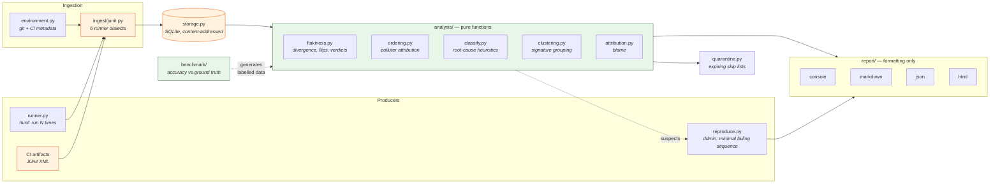
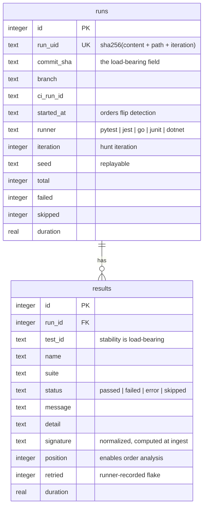
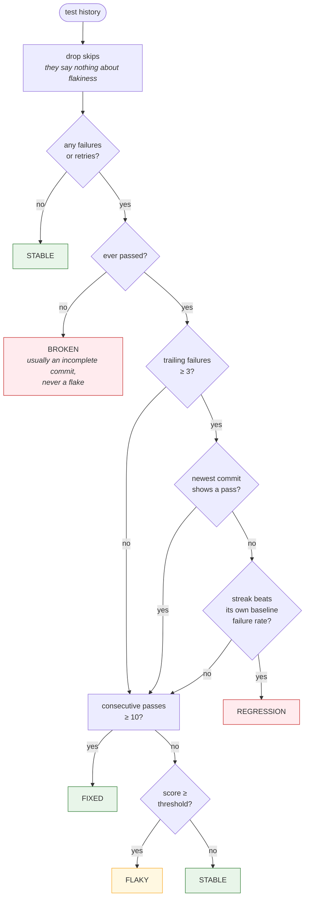
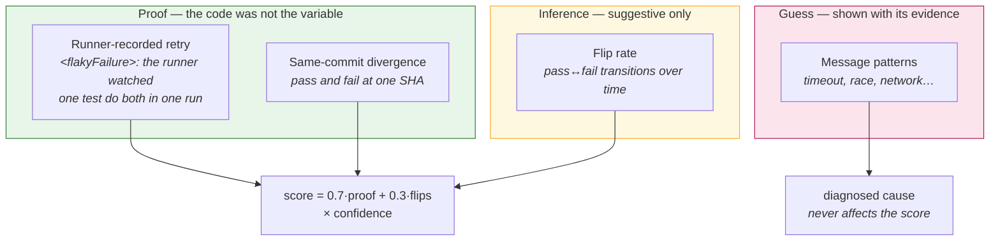

# Architecture

## The shape of it

A pipeline. Each stage has one input type and one output type, which is what lets
the analysis be tested without touching a filesystem or a database.



`reproduce.py` is the one producer that runs the suite to *answer a question* rather than
to collect history, and it is the only place where the tool's output is verified by
experiment instead of inference. Its search takes an injected oracle, so `ddmin` itself
never touches a subprocess and the whole algorithm is pinned by tests that run in a tenth
of a second. See
[ADR-0015](adr/0015-reproduce-by-experiment-not-correlation.md).

The dashed arrow from `benchmark` is worth noticing: it feeds generated data straight into
`analysis`, bypassing storage entirely. That is possible only because the analysis
layer is pure, and it is what lets accuracy be measured against the real scoring code
rather than a reimplementation of it.

## Dependency direction

One way, no exceptions:

```
cli → report → analysis → storage → models
```

`runner`, `reproduce`, `demo` and `benchmark` sit beside the pipeline as producers, feeding
it rather than being called by it.

Three rules hold this together, and all three are enforced by
[`tests/test_architecture.py`](../tests/test_architecture.py) rather than left as
prose that decays on the first hurried change:

| Rule | Why | Enforced by |
|---|---|---|
| `analysis/` must not import `sqlite3`, `storage`, `os` or `pathlib` | Keeps scoring testable with constructed data. Every scoring test would otherwise need fixtures and a filesystem. | `TestAnalysisIsPure` |
| `report/` must not compute a derived value | A number calculated inside one reporter is a number the other three will eventually disagree with. | `TestReportOnlyFormats` |
| `models` and `normalize` import nothing internal | Makes them safe to import everywhere without a cycle. | `TestModelsAndNormalizeAreLeaves` |

Runtime dependencies are capped at `typer` and `rich`, also enforced by test. Parsing,
storage and hashing all use the standard library, because every extra dependency is a
reason for someone not to install a tool that solves a side-concern.

## Data model

Two tables, deliberately denormalized. Analysis is read-heavy and the join cost on
every query is not worth the normalization.



### Two fields carry most of the weight

**`run_uid` is a content hash.** Chosen so ingest is idempotent under CI retries, but
it has a second consequence that took a while to exploit: two databases built
independently on different machines can be merged as a set union, correctly and
repeatably. That is what makes `flaky merge` sound rather than approximate, and what
makes sharded CI work. See [ADR-0005](adr/0005-content-addressed-runs.md).

**`test_id` stability is the assumption everything rests on.** If the same test yields
different ids across runs, its history fragments and it becomes invisible. This is why
ids are reconstructed rather than taken as given — pytest's default output omits the
file attribute entirely, so ids are rebuilt from the dotted classname into real
nodeids. See [ADR-0002](adr/0002-reconstruct-pytest-node-ids.md).

## How a verdict is reached

Exactly one verdict per test. Check order encodes the priorities: anything explainable
as a real break is reported as one, and `flaky` is checked last on purpose.



The "streak beats its own baseline" branch is the one that took a benchmark to get
right. Without it, a test failing 70% of the time was reported as a regression every
time it had an unlucky afternoon — 7 of 37 known flakes, in measurement. See
[ADR-0006](adr/0006-streak-beats-chance.md).

## Signal hierarchy

The scoring weights exist because these three signals do not deserve equal trust.



Root-cause classification deliberately never influences the score. A guess about *why*
a test is flaky must not change *whether* it is called flaky, or a pattern-matching
mistake would become a scoring mistake.

## Triage: the flow that matters most

Ranked lists are useful for paying down debt. The question people actually have is
"CI is red, do I investigate or re-run?".

```mermaid
sequenceDiagram
    participant CI
    participant flaky as flaky triage
    participant db as history

    CI->>flaky: junit.xml from a red build
    flaky->>db: load history, excluding this run
    Note over flaky,db: excluded so a first-time failure cannot<br/>use the evidence of itself
    db-->>flaky: prior outcomes
    flaky->>flaky: analyze, then classify each failure

    alt every failure is a known flake
        flaky-->>CI: exit 0 &mdash; no new breakage
    else a regression or broken test
        flaky-->>CI: exit 2 &mdash; needs a human
    else a new failure with no history
        flaky-->>CI: exit 2 &mdash; needs a human
    end
```

Excluding the run being triaged from its own baseline is a small detail with a large
effect: without it, a test failing for the first time contributes that failure to the
history it is judged against, which nudges it toward looking flaky exactly when it
should not.

## Where to add things

| Adding | Goes in | Nothing else changes |
|---|---|---|
| A result format (TAP, Allure) | new module in `ingest/`, registered in `ingest/__init__.py` | ✓ |
| A root-cause category | the rule table in `analysis/classify.py` | ✓ |
| An output format | new module in `report/`, wired in `cli.py` | ✓ |
| A detection signal | `analysis/flakiness.py`, weights at module level, documented in the design | ✓ |
| A ground-truth case for the benchmark | `benchmark/generate.py` | ✓ |

## Further reading

- [Scoring in detail](scoring.md) — the maths, and why each weight is what it is
- [Measured accuracy](accuracy.md) — precision and recall against known labels
- [CI integration](ci-integration.md) — recipes including sharded builds
- [Decision records](adr/) — the decisions, including the ones that were wrong first
