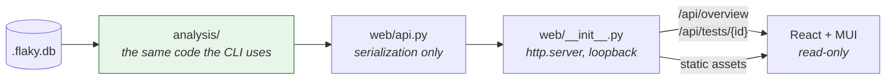

# Dashboard

```sh
flaky serve
```

Opens a local, read-only view of your test history on `http://127.0.0.1:8420`.

It answers one question above the fold: **can I trust my CI right now?** Everything that
does not help decide "investigate or re-run" is further down the page or behind a click.

## What it shows

### Overview

- **CI Trust Score**, 0–100, with every deducted point attributed to a named component.
- **Needs attention / Active flakes / Runs recorded / Tests tracked** as headline counts.
- **Ranked table** of tests by score, carrying the counts behind each verdict — runs,
  pass/fail, flips, same-commit divergence — so a row can be checked without opening it.
- **Shared failure signatures**: one cause affecting several tests, which is usually the
  cheapest thing to fix.
- **Caveats**, repeated from the CLI. A prettier interface is exactly where honesty about
  weak evidence tends to get quietly dropped, so the same warnings appear here.

### Test investigation

Click any test. Four things, in the order you need them:

| Section | Answers |
|---|---|
| **Evidence** | Why should I believe this verdict? |
| **Timeline** | What actually happened, run by run? |
| **Why** | What kind of bug is this, and what fixes it? |
| **Action** | What do I run next? |

The **Evidence** panel is the point of the page. It splits into two visually distinct
groups:

- **Proven by the detector** — same-commit divergence, runner-recorded retries, polluter
  correlation. Facts.
- **Inferred, weaker** — flip rate, missing commit data. Suggestive.

That separation is deliberate. A measured fact and a pattern match must not look alike,
or the weaker one borrows the authority of the stronger. It is the same rule the scoring
engine follows: root-cause guesses never influence whether a test is called flaky.

The **Timeline** groups runs by commit and outlines any group holding both a pass and a
fail. That outline *is* the proof of flakiness, so it is shown rather than described.

## The CI Trust Score

Built only from figures already collected. No fitted model, no fudge factor, and no
unexplained remainder: the component penalties account for the entire deduction, and the
headline number is that deduction taken off 100 and rounded to a whole number.

```
score = round(100 − deducted)      deducted = Σ component penalties
```

The card shows that arithmetic (`100 − 42.4 deducted = 58`) and the API returns
`trust.deducted` alongside `trust.score`. Both exist for the same reason: penalties are
displayed to one decimal, so a reader adding them up would otherwise land up to half a
point off the score with no way to tell rounding from an undisclosed adjustment.

A fractional score would be worse. Two decimals of trust implies a precision the inputs
do not have, and this project's rule is not to display more precision than the sample
size supports.

| Component | Ceiling | Deducts for |
|---|---:|---|
| Unresolved breaks | 35 | Regressions and never-passing tests |
| Flaky tests | 30 | Active flakes, weighted by score rather than counted |
| Commit evidence | 20 | Runs without a commit SHA |
| Quarantine debt | 15 | Entries left past their expiry |

Two choices worth explaining:

**Breaks outrank flakes.** A suite with one real regression is less trustworthy than one
with five known flakes, because the flakes are known. So a single unresolved break costs
more than a moderate amount of flakiness.

**Flakes are weighted, not counted.** Counting them would treat a test failing 1 run in
20 the same as one failing 10 in 20. The penalty sums their scores instead, so a
nearly-stable flake costs almost nothing.

**Missing commit data costs points**, and that is not a style complaint. Benchmarked, the
false alarm rate rises from 0% to 25% without commit SHAs. Verdicts really are weaker,
and the score is the honest place to say so.

### Wasted CI time

Shown as an estimate, and labelled as one everywhere it appears:

```
estimate = (flaky failures) × (median suite duration)
```

The assumption is that each flaky failure costs one re-run of the suite. It is a model,
not a measurement — the tool cannot see re-runs that happened outside its own view. It is
the most quotable number in the product and the least defensible, which is exactly the
combination that needs a visible caveat rather than a footnote.

## What it deliberately does not do

**No authentication, and no need for it.** The server binds to `127.0.0.1`. It is a
single-user local viewer, the same trust model as `python -m http.server` in a project
directory.

Passing `--host 0.0.0.0` publishes every test name, failure message and commit SHA in
your database to the network with no access control. That path prints a warning. Do not
use it on a shared machine.

**Read-only.** Nothing in the dashboard mutates the database, the quarantine list or the
filesystem. Actions are shown as commands with a copy button, so anything that changes
state stays a deliberate, reviewable step. A one-click "quarantine this" button would be
convenient and would also let someone silence a real regression by accident.

**No accounts, no organizations, no hosted backend.** The tool is a local CLI with a
SQLite file; adding a service would break the property that makes it adoptable.

## Running it

```sh
flaky serve                        # loopback, port 8420, opens a browser
flaky serve --port 9000            # different port
flaky serve --no-open              # do not launch a browser
flaky serve --db ci-history.db     # a specific database
flaky serve --quiet                # no request logging
```

The compiled dashboard is **committed to the repository** and shipped inside the wheel,
so `flaky serve` works from a plain `pip install` with no Node toolchain present. That is
an unusual choice for a Python package, and the reason is judge-friendliness: requiring a
frontend build before the UI can be seen would be a bad first five minutes.

`tests/test_web.py` checks the bundle is present, references an existing chunk, contains
the current UI strings and makes no external requests — so a stale bundle fails the build
rather than rendering a blank page.

## Working on the frontend

React 18, Material UI 6, TypeScript, Vite. Source in `web/`.

```sh
cd web
npm ci
npm run dev        # http://localhost:5173, proxies /api to a running `flaky serve`
```

Run `flaky serve` in another terminal; Vite proxies `/api` to it, so the dev server shows
real data rather than fixtures.

```sh
npm run build      # writes into src/flaky_detective/web/static/
npm run typecheck
```

Commit the rebuilt assets along with the source change.

## Architecture



Two properties hold this together:

**The dashboard cannot disagree with the terminal.** Both read the same `analysis/`
functions. `web/api.py` serializes and computes nothing — a test asserts that the
payload's verdicts and scores match `analyze()` exactly. A UI quietly showing a different
verdict from the CLI would be worse than no UI.

**No new runtime dependencies.** `http.server` from the standard library, so the runtime
requirement stays at `typer` and `rich`. Asking someone to install a web stack to look at
their test history is how a tool goes uninstalled.

## Endpoints

| Endpoint | Returns |
|---|---|
| `GET /api/overview` | Trust score, summary, ranked tests, clusters, quarantine, caveats |
| `GET /api/tests/{test_id}` | Evidence, timeline, diagnosis, blame, neighbours, actions |
| `GET /api/health` | Liveness and API version |

URL-encode the test id. Responses carry `api_version`; the frontend checks it and reports
a mismatch plainly rather than rendering blank panels.

Responses are `no-store`, fingerprinted assets are cached hard, and every response carries
a restrictive `Content-Security-Policy`. Failure messages come from test output, so they
are untrusted text being rendered in a browser: React escapes by default, and the CSP
means a mistake there cannot become script execution.

## From dashboard to workflow

The investigation page ends at "what do I run next". `flaky issue` closes the loop:

```sh
flaky issue test_expects_clean_registry                      # Markdown
flaky issue test_expects_clean_registry -f jira              # Jira wiki markup
flaky issue test_expects_clean_registry -f slack             # Slack Block Kit
```

The output carries the diagnosis, not a placeholder:

> **Order dependence flaky test: test_expects_clean_registry**
>
> - Same-commit divergence confirmed at 4 of 7 commits where it ran more than once.
> - Order dependent: fails after `test_registers_session` in 100% of its failures.
>   Retrying will not help — the state is already polluted.
> - Suggested fix: reset the shared state in setup or teardown.

Piped wherever it needs to go, with no credentials held by the tool:

```sh
flaky issue test_x | gh issue create --title "$(flaky issue test_x -f json | jq -r .title)" --body-file -
flaky issue test_x -f slack | curl -X POST -H 'Content-Type: application/json' -d @- "$SLACK_WEBHOOK"
```

Emitting rather than posting is deliberate. A built-in API client would mean holding a
token, and staying credential-free is worth more than saving a `curl`.
